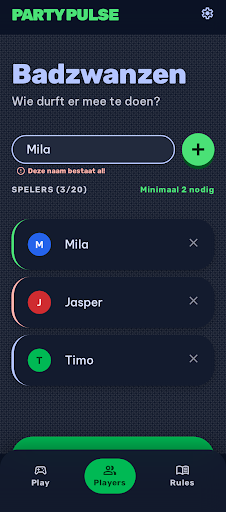

# Design Addendum: 001-add-players (Spelers toevoegen)

Extends [/DESIGN.md](../../DESIGN.md).

## Screens

- `projects/2820714669126137113/screens/d026d90c53de40498c533b5372397df7` — "Badzwanzen -
  Spelers Toevoegen" (mobile)
  
  Full mockup (self-contained, open directly in a browser): [`./design/spelers-toevoegen-mobile.html`](./design/spelers-toevoegen-mobile.html)
  Stitch project (for interactive editing): https://stitch.withgoogle.com/project/2820714669126137113

## What this feature adds or changes

The very first screen of the app, applying the shared "Vivid Social" design system
(`/DESIGN.md`) to feature 001's UI: brand header, a name-input row with a large tactile "+"
button and an inline duplicate-name error state, a scrollable player list with per-player
delete, a "SPELERS (n/20)" counter with a "minimaal 2 nodig" hint, and a high-contrast
"START HET SPEL" button (active once the 2-player minimum is met). No new tokens or component
patterns beyond what's already in the shared design system — this is a straightforward
application of it, not an extension.

## Review history

- 2026-07-26: an earlier round used a screen ("Party Pulse - Spelers Toevoegen") that already
  existed in the shared Stitch project from before this workflow existed. The developer
  rejected it explicitly — "die plaatjes waren een test, gooi weg en probeer opnieuw" — since it
  was leftover test content, not something actually designed and reviewed for this feature.
  Discarded (the file was deleted locally; the underlying Stitch screen still exists in the
  project since there's no delete-screen tool, but is not referenced by this feature).
- 2026-07-26: generated fresh (`generate_screen_from_text`) → Draft, screenshot saved to
  `specs/001-add-players/design/spelers-toevoegen-mobile.png`.
- 2026-07-26: Approved by the developer, no changes requested.
- 2026-07-26: added the self-contained generated HTML mockup
  (`specs/001-add-players/design/spelers-toevoegen-mobile.html`, from the screen's
  `htmlCode.downloadUrl`) alongside the screenshot, retroactively — until this point only the
  PNG was saved, so the actual generated markup depended on the Stitch project staying
  reachable.
