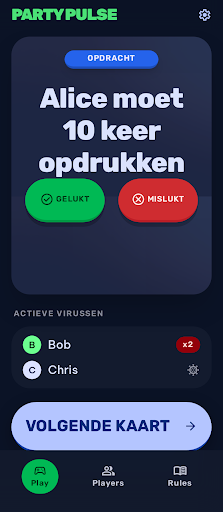
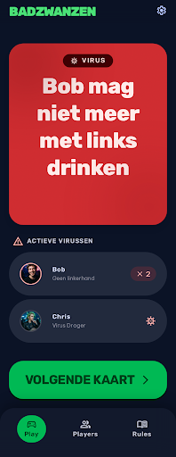
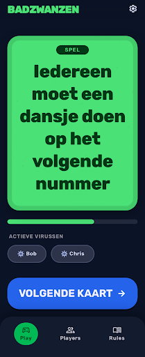

# Design Addendum: 004-assignments-and-viruses

Extends [/DESIGN.md](../../DESIGN.md).

## Screens

Three card-type variants of the core gameplay screen, sharing one layout (Game Card + "ACTIEVE
VIRUSSEN" summary + "VOLGENDE KAART" button + bottom nav) with type-specific Mode Chip color:

- **Opdracht** (assignment, primary blue) — placeholder reference only, see caveat below:
  `projects/2820714669126137113/screens/b4da9b769f4c44b6be585bccd214d8e7` — "Badzwanzen -
  Spelverloop" (mobile)
  
  Full mockup: [`./design/spelverloop-mobile.html`](./design/spelverloop-mobile.html)

- **Virus** (tertiary red/pink):
  `projects/2820714669126137113/screens/b572de85ac8141189d44cbe8479d1259` — "Badzwanzen -
  Virus Kaart" (mobile)
  
  Full mockup: [`./design/virus-mobile.html`](./design/virus-mobile.html)

- **Spel** (secondary green):
  `projects/2820714669126137113/screens/9838f74d53c24efeb525473bb16788a8` — "Badzwanzen -
  Spel Kaart" (mobile)
  
  Full mockup: [`./design/spel-mobile.html`](./design/spel-mobile.html)

Stitch project (for interactive editing): https://stitch.withgoogle.com/project/2820714669126137113

## Known caveats (not yet resolved)

- **Opdracht screen is a stale placeholder.** It still shows the original "PARTY PULSE"
  wordmark (should read "BADZWANZEN") and "GELUKT"/"MISLUKT" buttons (should be absent — see
  Scope note below). An `edit_screens` call to fix both was confirmed applied server-side (the
  tool returned the exact DOM operations performed), but the exported screenshot/HTML never
  refreshed, and two subsequent fresh-generation attempts for a clean replacement both
  timed out without producing a usable result. Per the developer's decision (2026-07-27), this
  screenshot is kept as a **layout reference only** — mentally substitute "BADZWANZEN" for
  "PARTY PULSE" and ignore the GELUKT/MISLUKT buttons when reviewing it. The Virus and Spel
  screens (generated after this one, without the buttons and with correct branding) show what
  the corrected Opdracht card should actually look like — same layout, primary-blue instead of
  tertiary-red/secondary-green.
- **Spel screen has minor rough edges**: instruction text renders in dark/black rather than
  white on the green background (the design system calls for white text on colored
  backgrounds for contrast); an unrequested progress bar appears at the bottom of the card; and
  the "ACTIEVE VIRUSSEN" rows render as compact pill chips rather than the richer
  avatar+subtext+badge row style used on the Virus/Opdracht screens. **Confirmed by the
  developer (2026-07-27): the richer avatar+name+subtext+badge row style — as shown on the
  Virus Kaart screen (and the original Spelverloop reference) — is the canonical
  `ActiveVirusList` design.** The Spel screen's compact-pill variant is a Stitch-generation
  inconsistency, not an alternative to choose between; implementation should follow the
  Virus/Opdracht row style everywhere, including on the Spel card.

## What this feature adds or changes

The core gameplay screen, one variant per card type: the currently drawn card (a "Mode Chip" —
"OPDRACHT"/"VIRUS"/"SPEL", colored blue/red/green respectively per the design system's mode
colors) with display-xl instruction text — the target player's name substituted inline for
specific cards (e.g. "Alice moet 10 keer opdrukken"), a general/all-players indicator for
general cards — and a compact "ACTIEVE VIRUSSEN" section below showing one row per affected
player (a count badge for players with more than one active effect, e.g. "Bob ×2"), plus a
"VOLGENDE KAART" button to draw the next card. **No success/failure controls anywhere** —
recording assignment/game outcomes and virus violations is out of scope for this feature (see
spec.md Clarifications, 2026-07-27); an earlier round of this screen included "GELUKT"/"MISLUKT"
buttons, removed after that scope decision. No new tokens or component patterns beyond the
shared design system — reuses its Game Card, Tactile Button, Mode Chip, and per-player list
conventions.

## Review history

- 2026-07-26: generated (`generate_screen_from_text`) — the tool call itself timed out
  client-side, but per its own guidance ("don't retry on timeout, poll instead") the generation
  had actually succeeded server-side; found via `list_screens`. Screenshot + HTML mockup saved
  to `specs/004-assignments-and-viruses/design/spelverloop-mobile.{png,html}`. → Draft, pending
  developer review.
- 2026-07-27: developer review — "gelukt/mislukt mag je voor nu vergeten... daarnaast zie ik
  nog niet wat de styling is van de schermen als er een opdracht, virus of spel getoond wordt.
  Die mogen visueel verschillen (maak hier verschillende schermen voor)." Change requested:
  remove success/fail buttons (a real scope change, not just a UI simplification — see spec.md
  Clarifications), and split into three visually distinct screens (blue/red/green).
- 2026-07-27: `edit_screens` applied to the Spelverloop screen (branding fix + button removal)
  confirmed server-side but never reflected in the exported screenshot/HTML. Generated
  "Virus Kaart" (red, no buttons) fresh — succeeded, screenshot/HTML saved. Generated "Spel
  Kaart" (green, no buttons, general card) fresh — succeeded with the rough edges noted above.
  Two further attempts to regenerate a clean "Opdracht Kaart" replacement both timed out with
  no result. Developer decided (given the time already spent) to keep the original Spelverloop
  screenshot as a layout-only placeholder reference rather than continue retrying. → Still
  Draft, pending final developer approval of this three-screen set (including the caveats
  above).
- 2026-07-27: Approved by the developer — "de designs zijn prima, hou er wel rekening mee dat
  er onderling wat verschillen zijn, zoals hoe het overzicht van active virussen eruit ziet. De
  originele variant hiervan is prima." Confirmed: the avatar+name+subtext+badge row style (Virus
  Kaart / original Spelverloop) is the canonical `ActiveVirusList` design — see the Known
  caveats note above. No further Stitch changes requested; remaining rough edges (Opdracht
  branding/buttons, Spel text contrast/progress bar/pill-chip style) are implementation-time
  fixes, not blockers.
