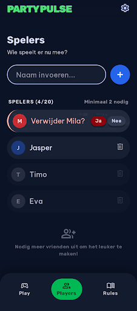

# Design Addendum: Spelers tijdens het lopende spel toevoegen en verwijderen

Extends [/DESIGN.md](../../DESIGN.md).

## Screens
- `projects/2820714669126137113/screens/98b2cdf19cbb4aa8a83fcaf2e82643a6` — "Spelers Beheer"
  (mobile), the live player-management view shown during an in-progress game: "+"-style add
  input at the top, active player list below with per-player delete icons, an inline
  "Verwijderen? Ja/Nee" confirmation state shown on the row being removed, and a
  "SPELERS (4/20) · Minimaal 2 nodig" status line.
  
  Full mockup (self-contained, open directly in a browser): `./design/spelers-beheer-mobile.html`
  Stitch project (for interactive editing): https://stitch.withgoogle.com/project/2820714669126137113

## What this feature adds or changes
Pre-existing screen in the shared Stitch project, reused as-is (no edits requested). It already
covers this feature's UI surface: adding a player via the same "+" input pattern used
pre-game (FR-001/FR-002), a per-player remove action with an explicit inline confirmation step
before deletion (FR-008), and a visible "Minimaal 2 nodig" indicator matching the 2-player floor
on removal (FR-009). The player count badge ("4/20") reflects the same max-20 validation used
elsewhere (FR-002). Screen title still carries stale "PARTYPULSE" header text from before the
brand rename to Badzwanzen — noted but accepted; cosmetic only, does not block implementation.

## Review history
- 2026-08-10: found pre-existing in the shared Stitch project (title "Badzwanzen - Spelers Beheer
  (Mobile)"). Flagged to the developer as unreviewed for this feature (not pre-approved just
  because it exists) — screenshot + HTML mockup saved to
  `specs/007-add-remove-players-live/design/spelers-beheer-mobile.{png,html}`.
- 2026-08-10: Approved as-is (no changes requested; stale header branding text accepted as
  cosmetic).
