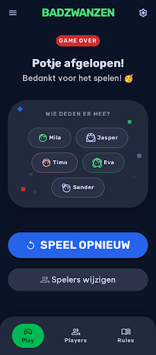

# Design Addendum: End of Game Screen

Extends [/DESIGN.md](../../DESIGN.md).

## Screens
- `projects/2820714669126137113/screens/c676d7bfb34d4be58ee880c2ae14845c` — End-of-game screen
  ("Potje afgelopen!"), shown when the draw pool is exhausted: player list ("Wie deden er mee?"),
  primary "Speel opnieuw" action, secondary "Spelers wijzigen" action.
  
  Full mockup (self-contained, open directly in a browser): `./design/einde-spel-mobile.html`
  Stitch project (for interactive editing): https://stitch.withgoogle.com/project/2820714669126137113

## What this feature adds or changes
New screen only — no changes to existing screens. Shown in place of a drawn card when the group
triggers "draw" and the session's pool is empty (FR-001). Lists every player from the session
(FR-002), offers "Speel opnieuw" to start a fresh session with the same players (FR-003) and
"Spelers wijzigen" to return to player setup pre-filled with the same players (FR-004).

## Review history
- 2026-08-09: generated (Draft) — screenshot + HTML mockup saved to
  `specs/008-end-of-game/design/einde-spel-mobile.{png,html}`
- 2026-08-09: Approved as-is (no changes requested)
