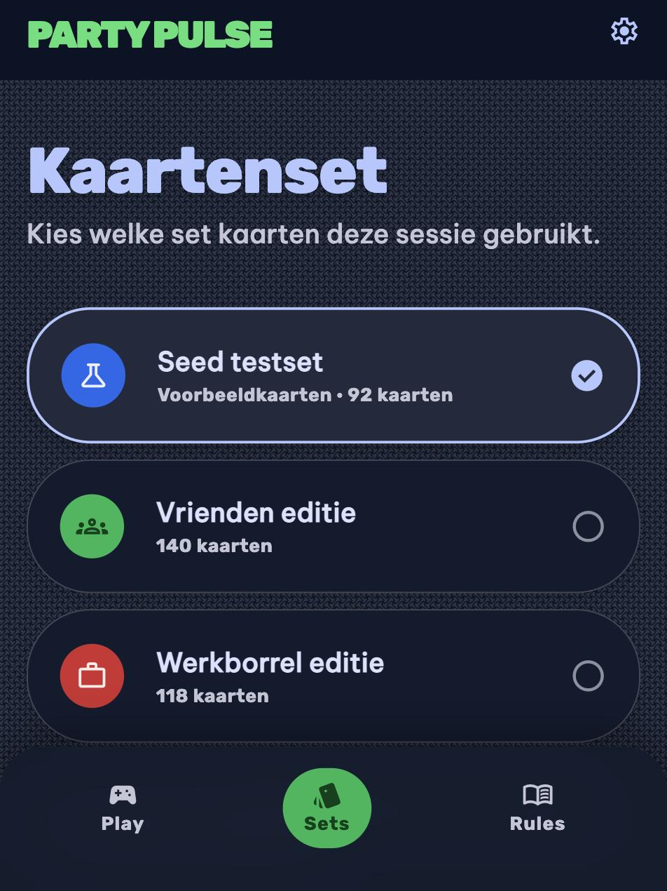

# Design Addendum: 010-card-sets

Extends [/DESIGN.md](../../DESIGN.md).

## Screens

- **Kaartenset kiezen** (card-set selection step, slots into session setup right after the
  existing "Spelers Toevoegen" screen and before the game starts):
  Not generated via Stitch — `mcp__stitch__generate_screen_from_text` timed out twice in a row
  with no screen produced (confirmed via `list_screens` after waiting both times; see Review
  history). Hand-authored instead, copying the exact Tailwind config, fonts, and component
  patterns from the existing `specs/001-add-players/design/spelers-toevoegen-mobile.html`
  mockup so it stays visually consistent with the already-approved screens.
  
  Full mockup: [`./design/kaartenset-kiezen-mobile.html`](./design/kaartenset-kiezen-mobile.html)

No Stitch screen resource name exists for this screen (manual-fallback path) — there is nothing
to look up in the shared Stitch project for it.

## What this feature adds or changes

A new setup step: a vertical list of named, selectable card-set cards (icon + name + card
count), one already selected by default (primary-colored border/fill + filled check-circle
icon; unselected sets show an outlined circle), followed by the existing "START SPEL" tactile
button restyled with the set list above it. Reuses existing tokens and component patterns only
— set-choice cards follow the same card/list-row conventions as the player list on the
Spelers Toevoegen screen (rounded-xl, surface-container-low/high, border-l accent →
here a full border + check-circle for the selected state instead), no new colors, typography,
or shapes introduced.

## Review history

- 2026-08-09: `generate_screen_from_text` timed out (client-side timeout). Per the tool's own
  guidance, checked `list_screens` for a server-side success — none found after a 45s wait.
- 2026-08-09: developer chose "Retry the generation" — second `generate_screen_from_text` call
  also timed out; `list_screens` checked again after a 60s wait, still no new screen. Stitch
  judged to be persistently failing, not a one-off blip.
- 2026-08-09: developer asked whether another tool/skill could produce the design instead of
  Stitch, "they do need to take the existing UI into account of course." No dedicated
  design-generation alternative to Stitch is available; instead hand-authored an HTML mockup
  reusing the exact Tailwind config/fonts/component classes from the existing, already-approved
  `spelers-toevoegen-mobile.html` screen (same project this step follows), then rendered and
  screenshotted it via the Chrome browser tools (served locally, screenshot saved) as the
  review artifact in place of Stitch's `screenshot.downloadUrl`. → Draft, pending developer
  review.
- 2026-08-09: Approved by the developer — no changes requested.
