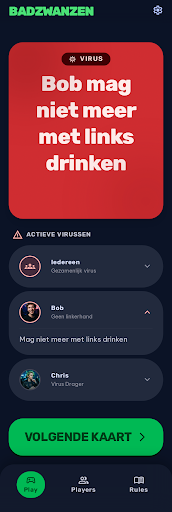

# Design Addendum: 016-virus-list-improvements

Extends [/DESIGN.md](../../DESIGN.md).

## Screens

- `projects/2820714669126137113/screens/22920cd1e94542618bf765ea20ff1f3a` — "Badzwanzen -
  Actieve Virussen Detail" (mobile), an edit of the canonical `004-assignments-and-viruses`
  "Virus Kaart" screen (`.../screens/b572de85ac8141189d44cbe8479d1259`, left unchanged), scoped
  to the "ACTIEVE VIRUSSEN" section only.
  
  Full mockup (self-contained, open directly in a browser): [`./design/virus-kaart-active-list.html`](./design/virus-kaart-active-list.html)
  Stitch project (for interactive editing): https://stitch.withgoogle.com/project/2820714669126137113

## What this feature adds or changes

Only the "ACTIEVE VIRUSSEN" list section changes — the rest of the gameplay card (Mode Chip,
instruction text, "VOLGENDE KAART" button, bottom nav) is untouched and stays exactly as
approved in `004-assignments-and-viruses`.

- **Shared "Iedereen" row**: a virus that targets every player now renders as one row labeled
  "Iedereen" with a group icon (stacked-people glyph) instead of an individual avatar, replacing
  what used to be one duplicate row per player. Individually-targeted virus rows keep their
  existing avatar+name+subtext+badge style unchanged (both styles shown together in the mockup:
  the "Iedereen" row alongside "Bob" and "Chris" rows).
- **Tap-to-reveal instruction text**: every row (individual or shared "Iedereen") gets a chevron
  affordance. Tapping expands the row downward to reveal the original virus instruction text as
  a small body-text snippet beneath the row; the chevron flips to indicate expanded state. The
  mockup shows Bob's row in this expanded state ("Mag niet meer met links drinken"). Collapsing
  works the same way (tap again).
- No new colors, typography, or component patterns beyond the existing design system — reuses
  the same row container, badge, and body-text styles already established in
  `004-assignments-and-viruses`.
- Not shown in this static mockup (interaction/state, not visual): the ×N-badge case (a row
  representing multiple stacked effects for one player) reveals all of those virus texts when
  tapped, per spec.md FR-005 — same expand pattern, just with multiple text snippets stacked
  under the row.

## Review history

- 2026-08-16: generated via `edit_screens` against the `004-assignments-and-viruses` "Virus
  Kaart" screen, scoped to the "ACTIEVE VIRUSSEN" section (Stitch created a new screen resource
  rather than mutating the original in place, so the original stays intact as a reference for
  other features). Screenshot + HTML mockup saved to
  `specs/016-virus-list-improvements/design/virus-kaart-active-list.{png,html}`. → Draft,
  pending developer review.
- 2026-08-16: Approved by the developer — no changes requested.
